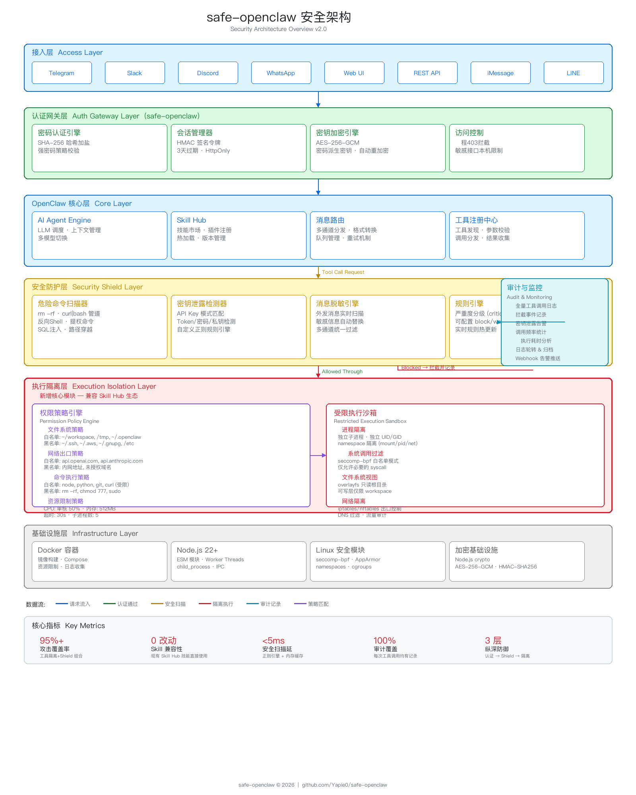

中文 | **[English](README.en.md)**

# safe-openclaw

> **[openclaw](https://github.com/openclaw/openclaw) 的安全增强版。**
> openclaw 默认没有任何认证机制，API 密钥以明文存储——把它部署到服务器上，任何人发现你的地址就能完全控制你的 AI 网关，拿走你所有的 API 密钥，造成大额账单。
> safe-openclaw 在 openclaw 之上构建了完整的安全架构：强制认证网关、AES-256 密钥加密、会话管理、敏感信息过滤、密码保护访问——一键替换，零迁移成本。

<p align="center">
  <a href="https://github.com/Yapie0/safe-openclaw/releases"></a>
  <a href="https://www.npmjs.com/package/safe-openclaw"></a>
  <a href="LICENSE"></a>
</p>

## 和 openclaw 有什么不同

| 功能               | openclaw                     | safe-openclaw                                           |
| ------------------ | ---------------------------- | ------------------------------------------------------- |
| 子进程沙箱执行     | 无防护                       | OS 级沙箱：macOS sandbox-exec / Linux namespace 隔离    |
| 首次访问           | 无需密码                     | 必须先设置密码才能使用                                  |
| 密码存储           | 明文 token                   | SHA-256 哈希加盐存储                                    |
| API 密钥存储       | 明文存储在配置文件           | AES-256-GCM 加密，密钥由密码派生                        |
| 密码强度           | 无要求                       | 至少 8 位，包含大小写字母和数字                         |
| 浏览器登录         | URL/localStorage 中的 token  | 密码 + 签名会话令牌（3 天过期，HttpOnly Cookie）        |
| 未设置时的远程访问 | 允许                         | 拒绝（403）                                             |
| 密码重置           | 无专用流程                   | Web 界面 + 命令行（仅限本机）                           |
| 聊天中的密钥泄露   | 无保护                       | 自动过滤敏感信息                                        |
| 大模型 API 配置    | 手动编辑 JSON 配置文件       | 一条命令交互式配置，自动连接测试，自动加密存储          |
| 运行环境隔离       | 无隔离，工具拥有完整系统权限 | Docker 容器隔离，恶意代码无法访问宿主机敏感文件         |
| 工具调用安全       | 无防护                       | Security Shield：危险命令拦截 + 密钥泄露检测 + 审计日志 |
| 工具执行隔离       | 无防护                       | Execution Isolation：文件/网络/命令白名单策略           |

### 架构图



## 安全补丁详情

### 1. 子进程沙箱执行（OS 级隔离）

AI 代理执行的每一条命令都可能对系统造成破坏。safe-openclaw 在工具执行层自动将命令包装到受限子进程中，**即使 AI 被注入了恶意指令，沙箱也能阻止它访问敏感文件和网络**。

**macOS（sandbox-exec）：**

- 自动生成 sandbox-exec 配置文件，限制文件系统读写和网络访问
- deny-default 模式下仅放行白名单路径（`/usr`、`/bin`、`/tmp` 等系统路径自动放行）
- 黑名单路径（如 `~/.ssh`、`~/.aws`）被完全禁止访问

**Linux（namespace 隔离）：**

- 使用 `unshare --mount --fork` 创建独立挂载命名空间
- 黑名单路径通过 `mount --bind /dev/null` 变为不可见
- 进程在隔离的文件系统视图中运行，无法访问被保护的目录

**跨平台资源限制：**

- `timeout` 命令强制执行超时（防止无限循环或挂起）
- `ulimit -f` 限制输出文件大小（防止磁盘填满攻击）

```json
{
  "plugins": {
    "execution-isolation": {
      "defaultAction": "deny",
      "filesystem": {
        "readAllow": ["~/workspace", "/tmp"],
        "writeAllow": ["~/workspace", "/tmp"],
        "deny": ["~/.ssh", "~/.aws", "~/.gnupg", "~/.openclaw"]
      },
      "resources": {
        "timeoutMs": 30000,
        "maxOutputBytes": 1048576
      }
    }
  }
}
```

> 子进程沙箱与 Execution Isolation 策略引擎配合工作：策略引擎先检查工具调用是否合规，通过后再用沙箱包装实际执行的命令，实现**双重防护**。

### 2. 强制密码认证网关（解决公网裸奔问题）

openclaw 首次运行时生成一个随机 token，但从不强制用户设置密码。safe-openclaw 添加了服务端 HTTP 认证网关，在请求到达网关之前拦截**所有**请求。在密码设置完成之前，网关完全锁定（远程请求返回 403）。

- 首次访问自动跳转到 `/setup`（仅限本机访问）
- 未认证的浏览器请求展示登录页面
- 未携带有效 token 的 API 请求返回 401
- WebSocket 连接同样受会话令牌保护

### 3. 密码哈希 + API 密钥加密

openclaw 将认证 token 和所有大模型 API 密钥以**明文**存储在 `~/.openclaw/openclaw.json` 中。

safe-openclaw：

- 使用 **SHA-256** 对密码进行哈希加盐存储
- 使用 **AES-256-GCM** 加密所有大模型 API 密钥，加密密钥由密码派生
- 修改密码时自动重新加密所有密钥

### 4. 聊天消息敏感信息过滤

双重防护：即使 API 密钥已加密存储，safe-openclaw 仍会扫描所有发出的消息，匹配已知的敏感信息模式并替换为 `**********`，防止任何形式的密钥泄露。在最极端的情况下，即使攻击者绕过了所有防护，拿到的也只是加密后的密文，而非明文密钥。

### 5. 密码强度要求

所有密码设置/重置操作强制要求：至少 8 个字符，包含大写字母、小写字母和数字。

### 6. 敏感接口仅限本机访问

`/setup`、`/reset-password` 和 `/api/safe/reset-password` 通过检查请求来源的 socket 地址来验证是否来自本机，非本机请求返回 403。

### 7. 修改密码后自动重启

通过 Web 界面修改密码后，网关会检测到配置变更并自动触发重启以应用新的加密密钥。重置页面包含"验证并继续"按钮，会自动轮询直到网关恢复在线。

## Security Shield 插件（内置）

safe-openclaw 内置了 **Security Shield** 插件，为 AI 工具调用提供实时安全防护：

### 危险命令拦截

自动检测并阻止高危操作：`rm -rf /`、`curl|bash` 管道执行、反向 Shell 等。所有工具调用参数在执行前经过安全扫描，critical 级别的匹配会直接拦截。

### 密钥泄露检测

扫描工具输出和外发消息中的敏感信息模式（API Key、Token、私钥等），自动替换为 `**********`，防止 AI 在对话中意外泄露密钥。

### 审计日志

所有工具调用自动记录到审计日志，包括工具名称、参数（已脱敏）、执行结果、是否被拦截及拦截原因，便于事后安全审查。

### 配置

在 `~/.openclaw/openclaw.json` 中配置：

```json
{
  "plugins": {
    "security-shield": {
      "enforcement": "block",
      "auditLog": true,
      "leakDetection": true
    }
  }
}
```

| 选项            | 说明                                            | 默认值    |
| --------------- | ----------------------------------------------- | --------- |
| `enforcement`   | `"block"` 拦截 / `"warn"` 仅告警 / `"off"` 关闭 | `"block"` |
| `auditLog`      | 是否记录审计日志                                | `true`    |
| `leakDetection` | 是否检测密钥泄露                                | `true`    |

## Execution Isolation 插件（内置）

**Execution Isolation** 插件为 AI 工具调用提供基于策略的访问控制，与 Security Shield 互补——Shield 通过正则模式拦截已知攻击，Isolation 通过白名单/黑名单控制结构化权限。

### 文件系统策略

控制 AI 可以读写哪些路径。黑名单优先于白名单，支持 `~` 展开和路径穿越防护。

### 网络出口策略

控制 AI 可以访问哪些域名。支持通配符匹配（如 `*.github.com`），防止数据外泄到未授权服务器。

### 命令执行策略

控制 AI 可以执行哪些命令。自动识别 `sh -c`、`bash -c` 包装和 `env` 前缀，提取真实命令进行匹配。

### 配置

在 `~/.openclaw/openclaw.json` 中配置：

```json
{
  "plugins": {
    "execution-isolation": {
      "enforcement": "block",
      "defaultAction": "allow",
      "filesystem": {
        "readAllow": ["~/workspace", "/tmp", "~/.openclaw"],
        "writeAllow": ["~/workspace", "/tmp"],
        "deny": ["~/.ssh", "~/.aws", "~/.gnupg"]
      },
      "network": {
        "allow": ["api.openai.com", "api.anthropic.com", "*.github.com"],
        "deny": ["10.*", "192.168.*"]
      },
      "commands": {
        "allow": ["node", "python", "git", "pnpm", "npm", "curl"],
        "deny": ["sudo", "chmod", "chown"]
      }
    }
  }
}
```

| 选项            | 说明                                            | 默认值    |
| --------------- | ----------------------------------------------- | --------- |
| `enforcement`   | `"block"` 拦截 / `"warn"` 仅告警 / `"off"` 关闭 | `"block"` |
| `defaultAction` | 无规则匹配时的默认行为                          | `"allow"` |
| `auditLog`      | 是否记录审计日志                                | `true`    |

> **兼容性说明：** Execution Isolation 与子进程沙箱配合工作，策略检查通过后自动包装命令到 OS 级沙箱中执行。工作在工具执行层，不修改 OpenClaw 的插件接口，与 Skill Hub 现有技能完全兼容。

## Docker 隔离部署（推荐用于生产环境）

AI 代理可以执行代码、调用工具、读写文件。openclaw 对这些操作没有任何隔离——AI 拥有和你一样的系统权限，一条恶意指令就可能删除文件、读取私钥、安装后门。社区 extension 中也可能包含恶意代码。

**Docker 部署将整个网关运行在隔离容器中**——即使 extension 有恶意代码，也无法访问宿主机的敏感文件和系统资源。

### 快速启动

```bash
# 1. 构建镜像
git clone https://github.com/Yapie0/safe-openclaw.git
cd safe-openclaw
docker build -t safe-openclaw .

# 2. 创建配置和工作目录
mkdir -p ~/.openclaw ~/.openclaw/workspace

# 3. 启动容器
docker run -d \
  --name safe-openclaw \
  --restart unless-stopped \
  -p 18789:18789 \
  -v ~/.openclaw:/home/node/.openclaw \
  -v ~/.openclaw/workspace:/home/node/.openclaw/workspace \
  safe-openclaw \
  node openclaw.mjs gateway --bind lan --allow-unconfigured
```

启动后访问 `http://localhost:18789` 设置密码。

### 使用 docker-compose

```bash
# 创建 .env 文件
cat > .env << 'EOF'
OPENCLAW_IMAGE=safe-openclaw
OPENCLAW_CONFIG_DIR=~/.openclaw
OPENCLAW_WORKSPACE_DIR=~/.openclaw/workspace
OPENCLAW_GATEWAY_PORT=18789
OPENCLAW_BRIDGE_PORT=18790
OPENCLAW_GATEWAY_BIND=lan
EOF

# 启动
docker compose up -d openclaw-gateway
```

### 容器内执行 CLI 命令

```bash
# 设置密码
docker exec -it safe-openclaw node openclaw.mjs set-password

# 运行 doctor
docker exec -it safe-openclaw node openclaw.mjs doctor

# 查看日志
docker logs -f safe-openclaw
```

### Docker 隔离了什么

| 威胁                              | 无 Docker       | Docker 部署         |
| --------------------------------- | --------------- | ------------------- |
| 恶意 extension 读取 `~/.ssh`      | ⚠️ 可以读取     | ✅ 容器内无此目录   |
| 恶意 extension 读取 `/etc/passwd` | ⚠️ 可以读取     | ✅ 隔离的文件系统   |
| `rm -rf /` 删除系统文件           | ⚠️ 会执行       | ✅ 只影响容器内部   |
| 恶意代码安装后门                  | ⚠️ 宿主机被感染 | ✅ 容器销毁即清除   |
| 窃取其他进程信息                  | ⚠️ 可以访问     | ✅ 进程命名空间隔离 |

> **注意：** 容器可以读写挂载的 `~/.openclaw` 目录。不要将 `~/.ssh`、`~/.aws` 等敏感目录挂载进容器。

---

## 已经在用 openclaw？一条命令完成安全升级

不需要卸载任何东西。安装脚本会自动检测 Node.js 环境和已有的 openclaw，原地替换并应用所有安全补丁——你的配置、会话、频道全部保留：

```bash
curl -fsSL https://raw.githubusercontent.com/Yapie0/safe-openclaw/main/install.sh | bash
```

安装脚本做了什么：

1. 检查 Node.js >= 22，不满足则自动通过 nvm 安装
2. 停止正在运行的网关
3. 卸载上游 openclaw，安装 safe-openclaw（`npm install -g safe-openclaw`）
4. 创建 `openclaw` 命令的符号链接，确保两个命令都可用
5. 提示下一步操作

升级后，`openclaw` 命令就完成了一次安全升级。你的配置和频道完全不受影响。

## 全新安装

```bash
curl -fsSL https://raw.githubusercontent.com/Yapie0/safe-openclaw/main/install.sh | bash
```

或者手动安装（需要 **Node >= 22**）：

```bash
npm install -g safe-openclaw
```

安装后 `openclaw` 和 `safe-openclaw` 两个命令都可以使用。

### 设置密码

```bash
# 方式一：命令行设置密码
openclaw set-password

# 方式二：启动网关后在浏览器设置
openclaw gateway run
# 首次访问 http://localhost:18789 会自动跳转到密码设置页面
```

### 配置大模型 API Key

设好密码后，一条命令配置你的大模型 API Key（自动加密存储）：

```bash
curl -fsSL https://raw.githubusercontent.com/Yapie0/safe-openclaw/main/scripts/safe-set-model.sh | bash
```

支持 Anthropic、OpenAI、Google Gemini、通义千问、DeepSeek、OpenRouter 等 10 种 Provider。详见下方[一键配置大模型 API](#一键配置大模型-api) 章节。

### 配置消息通道（以 Telegram 为例）

1. 在 Telegram 中找到 [@BotFather](https://t.me/BotFather)，发送 `/newbot`，按提示设置名称和 username，获得 Bot Token
2. 编辑 `~/.openclaw/openclaw.json`，添加 `channels.telegram` 配置：

```json
{
  "channels": {
    "telegram": {
      "botToken": "123456789:AABBccDDeeFFggHH",
      "dmPolicy": "open",
      "allowFrom": ["*"]
    }
  }
}
```

配置说明：

| 字段          | 说明                                                    |
| ------------- | ------------------------------------------------------- |
| `botToken`    | BotFather 给的 Bot Token                                |
| `dmPolicy`    | `"open"` 允许所有人私聊，`"allowlist"` 仅允许白名单用户 |
| `allowFrom`   | `["*"]` 允许所有人，或填 Telegram 用户 ID 数组限制访问  |
| `groupPolicy` | 群组策略：`"open"` / `"allowlist"` / `"disabled"`       |

> 其他支持的通道：Slack、Discord、WhatsApp、iMessage 等，配置方式类似，详见 [openclaw 文档](https://docs.openclaw.ai)。

### 启动网关

```bash
# 前台运行
openclaw gateway run

# 后台运行（SSH 断开后不会停止）
nohup openclaw gateway run > /tmp/openclaw-gateway.log 2>&1 &
```

## 一键配置大模型 API

安装完成、设好密码后，一条命令即可配置任意大模型的 API Key——交互式选择 provider，自动发送测试消息验证连通性，API Key 自动 AES-256-GCM 加密存储：

```bash
curl -fsSL https://raw.githubusercontent.com/Yapie0/safe-openclaw/main/scripts/safe-set-model.sh | bash
```

支持的 Provider：

| Provider        | 默认 Base URL                                       | 环境变量              |
| --------------- | --------------------------------------------------- | --------------------- |
| Anthropic       | `https://api.anthropic.com`                         | `ANTHROPIC_API_KEY`   |
| OpenAI          | `https://api.openai.com/v1`                         | `OPENAI_API_KEY`      |
| Google Gemini   | `https://generativelanguage.googleapis.com`         | `GEMINI_API_KEY`      |
| 通义千问 (Qwen) | `https://dashscope.aliyuncs.com/compatible-mode/v1` | `QWEN_PORTAL_API_KEY` |
| DeepSeek        | `https://api.deepseek.com/v1`                       | `OPENAI_API_KEY`      |
| OpenRouter      | `https://openrouter.ai/api/v1`                      | `OPENROUTER_API_KEY`  |
| Mistral         | `https://api.mistral.ai/v1`                         | `MISTRAL_API_KEY`     |
| xAI (Grok)      | `https://api.x.ai/v1`                               | `XAI_API_KEY`         |
| Together        | `https://api.together.xyz/v1`                       | `TOGETHER_API_KEY`    |
| OpenCode        | `https://opencode.ai/zen/v1`                        | `OPENCODE_API_KEY`    |

脚本会自动：

1. 检查密码是否已设置（未设置则提示先执行 `openclaw set-password`）
2. 让你选择 Provider、输入 Base URL 和 API Key
3. 向模型发送 `hello` 验证连通性，并显示模型回复
4. 用已有密码的 SHA-256 哈希作为密钥，AES-256-GCM 加密 API Key 后写入配置
5. 自动配置 `models.providers`，设置为默认模型

可以多次运行来配置不同的 Provider。Base URL 支持自定义，方便接入国内镜像或代理。

## 忘记密码

密码重置仅限本机操作：

```bash
openclaw set-password
```

或者在网关所在机器的浏览器中访问 `http://localhost:18789/reset-password`。

重置后网关会自动重启。如果没有自动重启，请手动执行：

```bash
openclaw gateway stop && openclaw gateway run
```

## 从源码构建

```bash
git clone https://github.com/Yapie0/safe-openclaw.git
cd safe-openclaw

pnpm install
pnpm build

pnpm openclaw gateway run
```

## 常用操作

### 初始配置（doctor）

如果启动网关时提示需要设置 `gateway.mode=local`，可以运行交互式配置向导：

```bash
openclaw doctor
```

该命令会引导你选择网关模式、配置 AI 模型和 API 密钥等。

或者跳过配置直接启动：

```bash
openclaw gateway run --allow-unconfigured
```

> **注意：** safe-openclaw 1.0.8+ 已默认自动使用 local 模式，通常不需要手动配置。

### 部署到公网

默认网关仅监听 localhost。要开放公网访问：

**1. 修改 `~/.openclaw/openclaw.json` 中的 bind 为 lan：**

```json
{
  "gateway": {
    "bind": "lan"
  }
}
```

**2. 配置 HTTPS 反向代理**（浏览器需要安全上下文才能正常使用所有功能）：

```nginx
# /etc/nginx/sites-available/openclaw-https
server {
    listen 443 ssl;
    server_name your-domain-or-ip;

    ssl_certificate     /path/to/cert.pem;
    ssl_certificate_key /path/to/key.pem;

    location / {
        proxy_pass http://127.0.0.1:18789;
        proxy_http_version 1.1;
        proxy_set_header Upgrade $http_upgrade;
        proxy_set_header Connection "upgrade";
        proxy_set_header Host $host;
        proxy_set_header X-Real-IP $remote_addr;
        proxy_set_header X-Forwarded-For $proxy_add_x_forwarded_for;
        proxy_set_header X-Forwarded-Proto https;
        proxy_read_timeout 86400;
    }
}
```

**3. 添加 `trustedProxies` 让网关信任反向代理：**

```json
{
  "gateway": {
    "bind": "lan",
    "trustedProxies": ["127.0.0.1"]
  }
}
```

**4. 重启网关：**

```bash
openclaw gateway stop && openclaw gateway run
```

### 设为系统服务（systemd）

创建 `/etc/systemd/system/openclaw-gateway.service`：

```ini
[Unit]
Description=safe-openclaw Gateway
After=network.target

[Service]
Type=simple
User=ubuntu
ExecStart=/usr/bin/openclaw gateway run
Restart=always
RestartSec=5
Environment=HOME=/home/ubuntu
WorkingDirectory=/home/ubuntu

[Install]
WantedBy=multi-user.target
```

启用并启动：

```bash
sudo systemctl daemon-reload
sudo systemctl enable openclaw-gateway
sudo systemctl start openclaw-gateway
```

### 后台运行脚本

仓库内附带便捷脚本：

- `daemon.sh` — 管理后台网关进程（`start`/`stop`/`restart`/`status`/`log`）
- `installandrun.sh` — 一键安装 + 后台启动

## 卸载 safe-openclaw

如果要卸载 safe-openclaw 并恢复上游 openclaw：

```bash
curl -fsSL https://raw.githubusercontent.com/Yapie0/safe-openclaw/main/uninstall.sh | bash
```

卸载脚本会：

1. 停止正在运行的网关
2. 卸载 safe-openclaw npm 包
3. 安装上游 openclaw
4. 你的 `~/.openclaw/` 配置保留不动

> **注意：** 配置文件中加密的 API Key（`enc:v1:...`）上游 openclaw 无法识别，需要手动替换为明文。

## 其他功能

openclaw 的所有功能（频道、技能、代理、工具、应用）完全正常使用。详见 [openclaw 文档](https://docs.openclaw.ai)。

## 反馈与 Bug 报告

遇到问题或有建议？请访问 [反馈页面](https://ai6666.com/feedback/) 提交。

## 许可证

[MIT](LICENSE)
